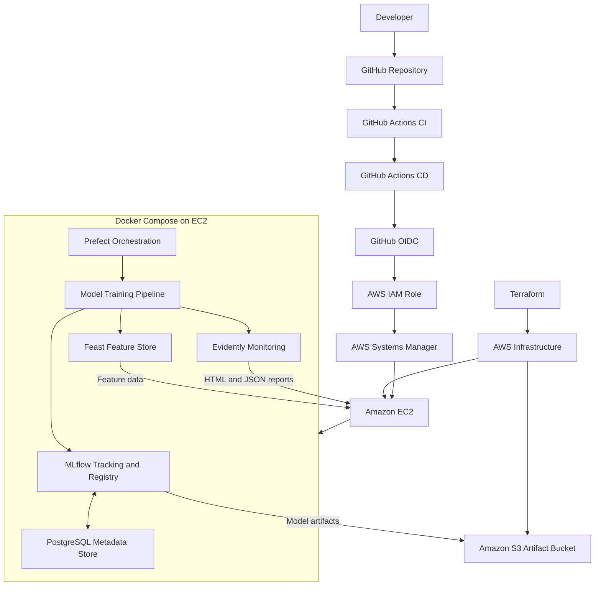

# MLOps Tools Evaluation Platform

A hands-on Cloud and DevOps project for identifying, implementing, and evaluating candidate tools across the MLOps lifecycle, including experiment tracking, model registry, CI/CD, workflow orchestration, feature management, and model monitoring.

The project deploys its AWS infrastructure with Terraform and uses GitHub Actions for automated validation and deployment. The MLOps platform runs with Docker Compose on Amazon EC2, with Amazon S3 used for model artifact storage.

## Project Objectives

- Evaluate practical tools for the main stages of the MLOps lifecycle.
- Track machine-learning experiments and metrics.
- Register and manage trained model versions.
- Automate testing and deployment with GitHub Actions.
- Orchestrate model-training workflows.
- Evaluate feature management with Feast.
- Generate model-monitoring reports with Evidently.
- Apply infrastructure as code and secure AWS deployment practices.
- Document implementation and validation evidence.

## Architecture



See [`docs/architecture/architecture.mmd`](docs/architecture/architecture.mmd) for the standalone Mermaid architecture source.

## Tools Evaluated

| MLOps capability | Tool | Purpose |
|---|---|---|
| Experiment tracking | MLflow | Record parameters, metrics, and training runs |
| Model registry | MLflow Model Registry | Register and version trained models |
| CI/CD | GitHub Actions | Automate code checks and deployment |
| Workflow orchestration | Prefect | Define and execute training workflows |
| Feature management | Feast | Evaluate feature definitions and retrieval |
| Model monitoring | Evidently | Generate model evaluation and monitoring reports |
| Metadata storage | PostgreSQL | Store MLflow tracking metadata |
| Artifact storage | Amazon S3 | Store model artifacts |
| Infrastructure as code | Terraform | Provision AWS infrastructure |
| Runtime | Docker Compose | Run the platform services on EC2 |
| Deployment access | GitHub OIDC and AWS Systems Manager | Authenticate workflows and access the EC2 deployment without relying on SSH keys |

These tools form the implemented evaluation platform. They are not a claim that every tool is the best choice for every production environment; selection should depend on workload, team skills, security, operational complexity, and cost.

## Implementation and Validation

The following checks and implementation results were observed during the project:

- **Terraform:** configuration validation completed successfully.
- **MLflow:** health endpoint returned HTTP 200.
- **Prefect:** API health endpoint returned `true`.
- **Training:** an MLflow run recorded accuracy of `0.9667` and weighted F1 of `0.9666` for the evaluated dataset and run.
- **Model registry:** a trained model was registered and versioned.
- **Amazon S3:** artifact objects were listed successfully.
- **Feast:** feature-store functionality was exercised as part of the evaluation.
- **Evidently:** HTML and JSON monitoring report files were generated.
- **GitHub Actions:** CI and deployment workflow runs completed successfully during project validation.

Metrics reflect the specific run and dataset used for this project; they should not be interpreted as a guarantee of performance on unseen or production data. Report generation alone does not establish that data drift or model degradation was detected.

## Repository Structure

```text
mlops-tools-evaluation/
├── .github/
│   └── workflows/
│       ├── ci.yml
│       └── deploy.yml
├── docs/
│   ├── architecture/
│   │   └── architecture.mmd
│   └── evidence/
│       ├── 01-mlflow-experiment-tracking.png
│       ├── 02-mlflow-model-registry.png
│       ├── 03-prefect-flow-overview.png
│       ├── 04-prefect-successful-run.png
│       ├── 05-s3-artifact-storage.png
│       ├── 06-feast-feature-management.png
│       ├── 07-evidently-monitoring.png
│       ├── 08-github-actions-ci-cd.png
│       └── 09-final-platform-validation.png
├── terraform/
├── README.md
└── ...
```

The application and supporting files are represented by the ellipsis above; the exact contents may change as the project evolves.

## Prerequisites

- Git and GitHub access.
- AWS CLI configured with suitable permissions.
- Terraform.
- Docker and Docker Compose where needed.
- Python and a virtual environment for local project tasks.
- An AWS account with permissions to provision the required resources.
- GitHub Actions configured with the required repository variables, secrets, and AWS OIDC trust.

Review AWS service costs, permissions, and regional availability before deploying.

## Deployment Overview

### 1. Clone the repository

```bash
git clone https://github.com/georgelolu/mlops-tool-evaluation.git
cd mlops-tools-evaluation
```

If the repository has already been cloned, continue from its local directory instead.

### 2. Configure deployment prerequisites

Review the Terraform configuration and the GitHub Actions workflows. Configure AWS credentials for local Terraform operations and set up GitHub OIDC trust and the required deployment permissions for GitHub Actions.

Do not commit credentials, private keys, access tokens, or `.env` files.

### 3. Validate Terraform

```bash
terraform -chdir=terraform fmt -check -recursive
terraform -chdir=terraform validate
```

Review the planned infrastructure changes before applying them. Do not apply Terraform solely to validate the documentation.

### 4. Deploy through the configured workflow

The deployment workflow uses GitHub Actions, AWS OIDC, an IAM role, and AWS Systems Manager to execute the configured deployment on EC2. Confirm that the workflow's required variables, permissions, and deployment commands match the repository configuration before running it.

### 5. Validate the platform

Run health checks for the deployed services and confirm that training, model registration, artifact storage, feature-store evaluation, and monitoring report generation complete as expected. Use the evidence screenshots in `docs/evidence/` to document the observed results.

## Security Considerations

The project demonstrates several useful practices:

- Infrastructure managed with Terraform.
- GitHub Actions authentication through AWS OIDC.
- A dedicated IAM role for deployment.
- AWS Systems Manager for deployment access.
- Separate metadata and model-artifact storage.
- Automated CI/CD validation.
- Exclusion of local environment files from version control.

This is an evaluation project, not a certification of production readiness. Before production use, review inbound security-group rules, IAM least privilege, secret management, TLS, service authentication, network segmentation, image vulnerabilities, logging, backups, retention policies, and monitoring alerts. Restrict administrative interfaces to trusted networks or private access paths.

## Evidence and Screenshots

| Evidence | Screenshot |
|---|---|
| MLflow experiment tracking | [01 — Experiment tracking](docs/evidence/01-mlflow-experiment-tracking.png) |
| MLflow model registry | [02 — Model registry](docs/evidence/02-mlflow-model-registry.png) |
| Prefect flow overview | [03 — Flow overview](docs/evidence/03-prefect-flow-overview.png) |
| Successful Prefect run | [04 — Successful run](docs/evidence/04-prefect-successful-run.png) |
| S3 artifact storage | [05 — S3 artifacts](docs/evidence/05-s3-artifact-storage.png) |
| Feast feature management | [06 — Feature management](docs/evidence/06-feast-feature-management.png) |
| Evidently monitoring | [07 — Monitoring report](docs/evidence/07-evidently-monitoring.png) |
| GitHub Actions CI/CD | [08 — CI/CD workflow](docs/evidence/08-github-actions-ci-cd.png) |
| Final platform validation | [09 — Final validation](docs/evidence/09-final-platform-validation.png) |

## Cleanup and Cost Management

AWS resources can continue to incur charges while running. When the evaluation is complete, review the Terraform configuration and state, identify the resources managed by this project, and follow the project's teardown procedure if the environment is no longer required.

Before destroying resources, confirm whether any model artifacts, reports, or other data must be retained. Do not manually delete shared or unrelated resources.

## Conclusion

This project demonstrates an end-to-end approach to evaluating MLOps tools while applying Cloud and DevOps engineering practices: infrastructure as code, containerized services, automated CI/CD, workflow orchestration, model tracking and registration, artifact storage, feature management, and monitoring-report generation.

The outcome is a documented, reproducible evaluation environment that can support further experiments and more informed tool-selection decisions.
